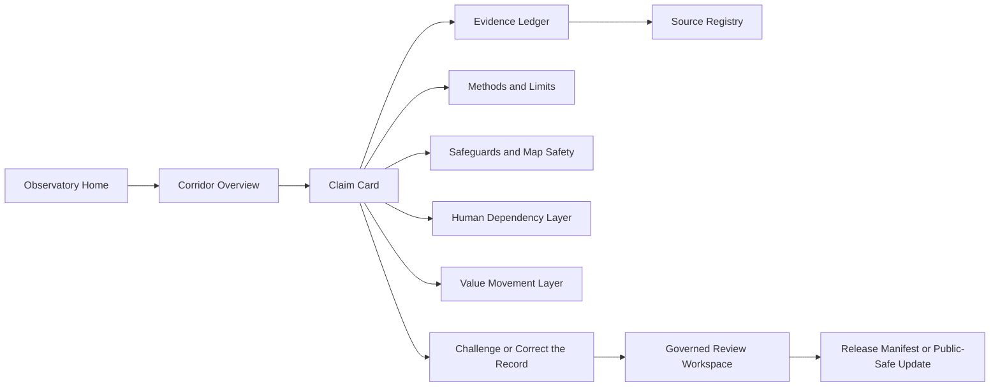
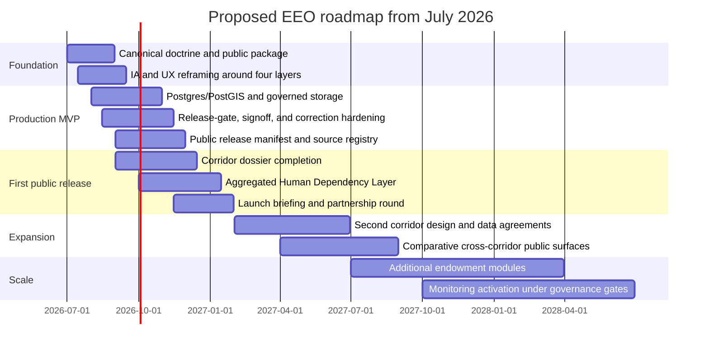

# Cohesive Package for the Earth Endowment Observatory

## Executive summary

The Earth Endowment Observatory already has a distinctive institutional core. The live site presents EEO as “a public observatory for natural wealth, stewardship, and accountability,” repeatedly emphasizes “evidence for inquiry, not a verdict,” and explicitly rejects legal overclaiming and unjustified chain-of-custody claims. The repository reinforces the same posture: EEO is framed as “public-interest evidence infrastructure” for “endowment-to-economy chains,” not a dashboard product, ESG score, generic open-data dump, blockchain trust layer, or AI judgment surface. That doctrinal discipline is a real advantage, because it gives EEO a credible identity before it tries to scale functionally. citeturn1view0turn3view0turn3view1turn3view2turn3view3turn4view2turn21view5

The strongest next step is not to turn EEO into a giant atlas all at once. It is to package EEO as a **dossier-first, rights-aware public-interest observatory** that begins with one corridor, adds one coherent **Human Dependency Layer**, and only later expands into broader endowment inventories and governed monitoring. That recommendation follows both the current EEO roadmap and contemporary international practice: EEO’s own roadmap defers runtime monitoring and temporal profiles until much later, while official Earth-observation and environmental-accounting frameworks such as GEOSS, SEEA, UN-IGIF, and the Global Statistical Geospatial Framework all point toward interoperable, standards-based integration rather than a single monolithic “map everything now” product. citeturn4view2turn4view3turn12search0turn12search1turn12search5turn18search1turn18search3

The package below therefore recommends five tightly linked deliverables: a canonical foundational document; an MVP that extends the current live site’s dossier, evidence, safeguards, and correction architecture; a GTM strategy aimed first at expert intermediaries and public-interest institutions; a phased roadmap that respects EEO’s own governance boundaries; and an implementation plan with lean, base, and accelerated budget scenarios. Because team size, budget, and target geography were not specified, the report explicitly marks estimates and assumptions where appropriate. citeturn14view0turn14view1turn21view0turn4view3

## Foundational package

EEO’s foundational package should formalize what the current live site and repository already imply: EEO is not “just a product,” but a public-interest knowledge institution with a disciplined publication posture. The live site already uses language about stewardship, accountability, uncertainty, safeguards, and correction; the repo’s doctrine, evidence standard, language-safety checklist, and brand doctrine add the missing constitutional layer. The most effective package is therefore a short, public-facing constitutional document paired with a more technical systems specification and a language guide. citeturn1view0turn3view0turn3view1turn3view2turn19view0turn21view1turn21view3turn21view5

The foundational document should contain four core blocks: **mission**, **doctrine**, **public definition**, and **brand language rules**. The current repo already provides much of the doctrine in dispersed form: people are not inventory items; public claims must name evidence roles and limitations; right of reply is a publication discipline; and disclosure must remain tiered because “universal knowledge does not require universal exposure.” Consolidating those into one authoritative document would reduce drift across product copy, press descriptions, partnership decks, and technical documentation. citeturn3view3turn4view0turn4view1turn4view2turn19view2turn21view1turn21view2turn21view4

A brand-aligned canonical mission statement should read like this:

> **Earth Endowment Observatory is a public-interest observatory of the natural foundations of life. It documents where Earth’s endowments are found, what functions they serve, who depends on them, how their quantity and quality change, and how their value moves through economies and societies. Its purpose is to make stewardship, interdependence, evidence, uncertainty, and public responsibility visible.**  

That formulation is consistent with the live site’s “public observatory” language, the repo’s endowment definition, the human-capability doctrine, and international ecosystem-accounting frameworks that explicitly connect environmental stocks and ecosystem services to economic and human activity. citeturn1view0turn3view3turn21view4turn12search1turn12search5

A brand-aligned doctrinal statement should preserve the phrases you want to carry forward, while sharpening their institutional meaning:

> **From Earth to life, from life to economy, from economy to responsibility — made visible.**  
> EEO reveals systems without exposing people to unnecessary harm. It documents evidence without pretending to adjudicate guilt, title, or sovereignty. It shows where value moves, where uncertainty remains, and where correction is required.

That synthesis is faithful to current EEO doctrine: “public-interest evidence infrastructure,” “evidence for inquiry, not a verdict,” “make the chain visible,” and “protect what exposure could harm.” citeturn1view0turn3view3turn4view2turn21view5

The foundational package should also define the product’s four analytic layers in simple, reusable wording:

| Layer | Canonical public definition |
|---|---|
| **Natural Endowment Layer** | Documents water, land, soil, forests, biodiversity, minerals, energy, climate systems, and ecological functions: what exists, where it exists, in what quantity and condition, and how it changes. |
| **Human Dependency Layer** | Shows how populations depend on endowments for water, food, livelihoods, mobility, culture, labor, and survival, using aggregated and rights-aware data only. |
| **Value Movement Layer** | Tracks how endowments become economic value through extraction, labor, processing, transport, trade, ownership, public revenue, and ecological cost. |
| **Governance, Evidence, and Safeguards Layer** | Governs what may be collected, analyzed, published, aggregated, restricted, corrected, or withheld, and preserves source limits, review status, map safety, and right of reply. |

The wording above is a direct extension of the repo’s corridor-dossier structure, evidence standard, map-safety types, access-governance types, and human capability work. citeturn19view3turn19view4turn21view1turn23view0turn23view1turn23view2turn23view3

The most important language rule is negative: EEO should **never** sound like a surveillance system, a certification regime, an ownership registry, or a scoring/ranking engine. The brand doctrine already says this clearly. The foundational package should make the following phrases standard and reusable across the website, decks, and outreach: “public observatory,” “evidence for inquiry, not a verdict,” “reported,” “contextualizes,” “limits,” “does not prove,” “right of reply,” “public-safe summary,” “aggregated,” and “withheld for safety.” It should ban casual use of “proves,” “traceable to this mine,” “caused,” “illegal,” “corrupt,” “owns this resource,” or any similar adjudicatory language without authoritative legal or regulatory support. citeturn21view1turn21view3turn21view5

## MVP specification

The current public EEO already contains the bones of a viable MVP: a corridor profile, claim cards, an evidence ledger, methods and limits, safeguards, a correction route, a value-chain page, and an evidence dossier. The repository adds a modular Next.js monolith on Vercel, type-based governance, prototype file-backed persistence, and a planned but not yet integrated Supabase data plane. The main gap is not concept; it is production hardening, coherent layer design, and the addition of a carefully bounded **Human Dependency Layer**. citeturn14view0turn14view1turn14view2turn14view3turn21view0turn2view1

The MVP should remain **corridor-first**, not atlas-first. The product unit should still be the corridor dossier, because the repo explicitly treats the dossier as the core public object and defers global-atlas ambitions, monitoring dashboards, live feeds, scenario UIs, composite scores, and expanded temporal features. The right move is therefore to strengthen the current corridor product and make the four layers legible within it. citeturn3view3turn4view1turn4view2turn4view3

### MVP feature priorities

| Priority | Feature | Why it belongs in the MVP | Recommended release posture |
|---|---|---|---|
| **Must have** | Canonical landing page with mission, doctrine, and warning against overclaiming | Converts the current doctrinal fragments into one public narrative | Public |
| **Must have** | Corridor dossier with section statuses and public limitations | Already central to repo architecture and live evidence-dossier route | Public |
| **Must have** | Claim cards with evidence roles, non-proofs, revision conditions, review status, and correction links | Already the strongest EEO differentiator | Public |
| **Must have** | Evidence ledger and source registry | Essential for verifiability and source humility | Public |
| **Must have** | Methods, safeguards, map-safety note, right-of-reply explainer | Necessary for legitimacy and misuse prevention | Public |
| **Must have** | Correction route with factual correction, right of reply, and harm-risk restriction paths | Already present in live concept; needs hardening | Public + governed intake |
| **Must have** | **Human Dependency Layer** panel at aggregated geography only | Extends EEO’s doctrine into social context without individual exposure | Public aggregated only |
| **Must have** | Release manifest and public-safe publication status | Needed for trust and disciplined releases | Public summary + governed backend |
| **Should have** | Generalized map view with map-safety classifications | Supports orientation without exposing sensitive coordinates | Public generalized only |
| **Should have** | Internal review workspace with auth, audit trail, and signoff support | Already conceptually present; required before live governed evidence | Restricted |
| **Should have** | Freshness checks and source-review cadences | Prevents stale public claims | Restricted workflow + public dates |
| **Later** | Monitoring signal registry | Allowed only as contract/type first, not public monitoring UI | Restricted/type-only initially |
| **Later** | Multi-corridor compare view | Valuable only after one corridor becomes trustworthy | Public later |
| **Later** | Temporal/foresight views | Repo explicitly defers these; they should remain gated | Post-v1.5+ only |

The table above is consistent with the current site and with the repo’s “do-not-build” posture, dormant temporal boundary, and staged roadmap. citeturn3view3turn4view2turn4view3turn21view0

### Core data sources by layer

EEO’s source strategy should favor official and primary systems first, then peer-reviewed or carefully curated complements. The current live site and source map already point in this direction by naming USGS, UN Comtrade, EITI, Open Ownership, ResourceContracts, ILOSTAT, SEEA, and IPBES as standards or source systems for citation, interoperability, or methodological alignment. citeturn1view0turn14view0turn20view1

| Layer | Core source families | Suggested MVP source strategy |
|---|---|---|
| **Natural Endowment Layer** | NASA MODIS land cover citeturn5search0; USGS Landsat citeturn5search1; Copernicus Land Monitoring Service citeturn5search6turn5search2; FAO AQUASTAT for water resources citeturn16search0; FAOSTAT land-use statistics citeturn6search2turn6search6; FAO Global Forest Resources Assessment citeturn17search0turn17search4; USGS Mineral Commodity Summaries citeturn7search0; GBIF biodiversity records citeturn17search2; SEEA ecosystem accounting citeturn12search1turn12search5 | Prefer one primary official source per endowment domain for the public layer; use cross-source comparison only when explicitly labeled as contextual or contradictory. |
| **Human Dependency Layer** | UN World Population Prospects citeturn6search0turn6search4; World Bank population and development indicators citeturn6search1turn12search7turn12search11; national statistical offices via UN statistical frameworks citeturn8search3turn18search1; WorldPop for gridded population estimates with uncertainty citeturn8search2turn8search6turn8search18; ILOSTAT for labor context citeturn6search3turn6search7 | Publish only aggregated dependency indicators; retain raw or high-resolution material in governed systems if ever collected. |
| **Value Movement Layer** | UN Comtrade trade flows citeturn5search3; USGS minerals context citeturn7search0; EITI country disclosures citeturn7search1turn7search5; Open Ownership beneficial ownership frameworks and data standards citeturn7search2turn7search6; ResourceContracts public contracts citeturn7search3turn7search7; World Bank DataBank and Data Catalog for macroeconomic context citeturn12search11turn12search3 | Treat all value-flow data as role-specific evidence: contextual, limiting, or supporting. Do not present aggregate trade data as chain-of-custody proof. |
| **Governance, Evidence, and Safeguards Layer** | EEO evidence standard, map safety, right of reply, access governance, review signoff, disclosure policy, language-safety checklist citeturn21view1turn21view2turn19view2turn23view2turn23view3turn23view4turn4view1turn21view3; UN data-protection and OCHA data-responsibility principles citeturn8search1turn8search12turn8search16 | Use these as the release-governance engine. Every public object should carry access, review, safety, and correction metadata. |

### Core schema for the four EEO layers

The current repo already has strong type primitives for claims, evidence, access governance, map safety, and human capability. The following schema extends those into a more production-ready model while remaining faithful to EEO’s doctrine. citeturn19view3turn19view4turn23view0turn23view1turn23view2turn23view3turn23view4

| Layer | Primary entity | Required fields | Typical grain | Publication posture |
|---|---|---|---|---|
| **Natural Endowment Layer** | `endowment_observation` | `id`, `endowment_type`, `geography_id`, `geometry_generalized`, `quantity_value`, `quantity_unit`, `quality_metric`, `renewability_class`, `seasonality`, `time_period`, `source_id`, `method`, `confidence`, `limitations`, `access_tier` | Basin, admin unit, corridor segment, eco-region | Public if generalized or aggregated; withhold exact sensitive locations |
| **Human Dependency Layer** | `dependency_aggregate` | `id`, `geography_id`, `population_total`, `aggregation_level`, `density`, `livelihood_profile`, `water_dependency`, `food_system_dependency`, `labor_context`, `vulnerability_flags`, `source_id`, `uncertainty`, `min_population_rule`, `suppression_applied`, `access_tier` | District, province, basin, corridor catchment, safe hex bin | Public aggregated only; no household or individual data |
| **Value Movement Layer** | `value_flow_record` | `id`, `commodity`, `stage`, `origin_geography_id`, `destination_geography_id`, `actor_types`, `volume`, `unit`, `reported_value`, `currency`, `period`, `source_id`, `evidence_role`, `limitations`, `confidence`, `access_tier` | Country-country, corridor-country, facility-country, year/month | Public if role and limitations are explicit |
| **Governance, Evidence, and Safeguards Layer** | `publication_object` | `object_type`, `object_id`, `claim_type`, `legal_posture`, `review_status`, `right_of_reply_status`, `access_tier`, `publication_decision`, `map_safety_class`, `correction_status`, `release_manifest_id`, `public_limitations`, `internal_notes_pointer` | One row per claim, evidence item, source, map layer, or dossier section | Public-safe summary only; internal rationale and raw review notes restricted |

### Recommended tech choices

The current repo is already on a sensible public-web foundation: Next.js, React, pnpm, Node 20+, and Vercel. The main technical decision is therefore not whether to rewrite the frontend, but how to add governed spatial data, release governance, and safe publication infrastructure without breaking the dossier-first model. citeturn2view1turn21view0

| Layer | Current or minimal choice | Stronger production choice | Recommendation |
|---|---|---|---|
| Public web app | Next.js App Router on Vercel | Same | **Keep** the current choice. Next.js App Router is already in use, and Vercel is the native deployment platform for Next.js. citeturn2view1turn9search0turn9search1 |
| Governed relational data | Prototype file-backed JSON stores | Postgres + PostGIS with RLS | **Upgrade** to a governed relational store. The repo already names Supabase/Postgres as the deferred data plane, and PostGIS is the standard extension for spatial storage and indexing. citeturn21view0turn9search2turn9search6turn10search3 |
| Map rendering | Static illustrations / generalized map | MapLibre GL JS + PMTiles | **Adopt** MapLibre + PMTiles for public generalized layers. MapLibre is an open WebGL mapping library, and PMTiles is designed for low-maintenance single-file tiled delivery. citeturn9search3turn9search7turn11search0turn11search16 |
| Batch analytics | Ad hoc scripts | DuckDB + Parquet/GeoParquet | **Adopt** DuckDB for reproducible batch analysis and Parquet/GeoParquet as portable analytical storage. citeturn10search0turn11search3turn11search7 |
| Raster distribution | Raw files | Cloud-Optimized GeoTIFF | **Use** COG for public-safe rasters and previews. citeturn11search2turn11search6 |
| Object storage | GitHub only for public prototype artifacts | Private evidence vault + public release bucket | **Separate** public assets from restricted evidence storage; the repo already anticipates this in its target architecture. citeturn21view0 |
| Monitoring/observability | Platform logs only | OpenTelemetry + error monitoring | **Instrument** traces, metrics, and errors early, but keep user analytics privacy-minimized. citeturn13search1turn13search5turn13search3 |

### Privacy, safeguards, and population-aggregation rules

This is the make-or-break area for EEO. The live site and repo already establish a strong rule set: no sensitive community data without consent, no sacred sites, no exact vulnerable ecological coordinates, no unverified allegations about identifiable persons, no public labor-availability maps that enable exploitation, and no treatment of human beings as endowment inventory. International guidance points in the same direction. OCHA’s 2025 Data Responsibility Guidelines and UN personal-data principles both emphasize accountable, proportional, rights-respecting data handling, while WorldPop itself foregrounds uncertainty and transparent methods. citeturn3view1turn4view0turn4view1turn4view2turn8search1turn8search12turn8search16turn8search2turn8search6

For the **Human Dependency Layer**, I recommend six non-negotiable safeguards:

| Rule | Operational requirement |
|---|---|
| Aggregation only | Publish population and dependency metrics only at safe administrative or hex-bin levels, never at household or individual level. |
| Minimum-cell suppression | Do not render cells below a minimum population threshold; merge or suppress sparse cells. |
| No sensitive attributes | Do not publish person-level or small-area data on ethnicity, religion, caste, disability, migration status, union activity, whistleblowing, sacred association, or similarly targetable identities. |
| No actionable vulnerable locations | Do not display exact camp, artisanal-worksite, sacred-site, endangered-species, or whistleblower-linked locations. |
| Not-collected is valid | If a category cannot be made safe, EEO should not collect or retain it. |
| Public-safe summaries only | Correction, review, and release surfaces should expose only public-safe rationale, never internal notes or identifying packets. |

Those rules are fully consistent with EEO’s existing access-governance and map-safety types, which already recognize `not_collected` as a valid outcome and distinguish public, aggregated, internal, restricted, and do-not-publish tiers. citeturn21view2turn23view2turn23view3

A clean MVP UI flow should look like this. It closely follows the live site’s current structure while adding a bounded **Human Dependency Layer** and a release-manifest checkpoint. citeturn1view0turn14view0turn14view1turn3view2

## Go-to-market plan

EEO’s GTM should begin with a sober reality: the first users should not be “everyone.” The current product is strongest where it serves disciplined intermediaries—researchers, journalists, civil-society investigators, philanthropic program officers, public-interest policymakers, and academic reviewers—because those audiences understand evidence roles, limitations, and correction pathways. The site’s own language and the evidence standard strongly support that positioning. citeturn1view0turn14view0turn21view1turn21view5

### Target audiences and value propositions

| Audience | What EEO gives them | Why they are an early fit |
|---|---|---|
| Public-interest researchers and universities | A verifiable corridor dossier with evidence roles, source limits, and correction pathways | EEO is already dossier-first and source-humble |
| Investigative and explanatory journalists | A safer way to inspect source chains without forcing accusations or overclaiming | EEO already distinguishes contextual, limiting, and supporting evidence |
| Extractive-transparency and anti-corruption organizations | A structured public record linking endowment, governance, value movement, and evidence gaps | The current source map already aligns with EITI, Open Ownership, and ResourceContracts |
| Philanthropic funders | A legible theory of change linking natural wealth, public evidence, and stewardship | EEO is institution-shaped, not merely app-shaped |
| Government and multilateral analysts | A rights-aware observatory prototype aligned with SEEA, UN statistics, and earth-observation infrastructure | Official standards compatibility is already visible in the source strategy |
| Educators and serious public users | A plain-language gateway into how endowments, people, and value chains interact | The live site already tries to explain “what this does not prove” |

The recommended positioning line is:

> **Earth Endowment Observatory is a public-interest evidence institution that helps people see what exists, who depends on it, how value moves, and what remains uncertain.**

That line is stronger than a generic “resource transparency platform,” because it preserves EEO’s civic, epistemic, and safety-aware identity. It also creates room for the **Human Dependency Layer** without reducing people to inputs. citeturn3view3turn21view4turn21view5

### Messaging architecture

The public message should be built around four repeatable pillars.

| Pillar | Message |
|---|---|
| **See the endowment** | EEO makes the Natural Endowment Layer legible: water, land, forests, biodiversity, minerals, energy, and ecological function. |
| **See who depends** | EEO adds a Human Dependency Layer that shows population dependence, livelihoods, labor context, and vulnerability in aggregated, rights-aware form. |
| **See how value moves** | EEO tracks the Value Movement Layer from extraction and processing to trade, revenue, benefit, and ecological cost. |
| **See what remains uncertain** | EEO does not hide uncertainty; it labels evidence roles, limitations, withheld material, and correction routes. |

The messaging discipline should always preserve one public distinction: **EEO reveals systems; it does not pretend to certify them.** That is the line that protects the brand from drifting into false traceability claims or pseudo-regulatory authority. citeturn1view0turn3view0turn14view1turn21view1turn21view5

### Launch channels and partnership strategy

EEO should launch in concentric rings rather than in one broad “big reveal.” The first ring should be an owned release package: the site, a concise doctrine PDF, a two-minute walkthrough, a one-page methods memo, and a founder letter explaining why EEO is dossier-first and why it suppresses certain geographies or population detail for safety. The second ring should be targeted briefings with researchers, investigative desks, transparency practitioners, and philanthropic program officers. The third ring should be institutional partnerships anchored in data credibility and review, not just distribution. citeturn19view0turn21view5turn4view3

The best-fit partnership classes are the ones already closest to EEO’s data and governance model:

| Partnership class | Best-fit examples | Why they fit EEO |
|---|---|---|
| Earth observation and geospatial standards | GEOSS/GEO citeturn12search0; UN-IGIF and GSGF citeturn18search1turn18search3; NASA Earthdata citeturn5search0turn16search5; Copernicus Land Monitoring Service citeturn5search6turn16search10 | They strengthen the Natural Endowment Layer and interoperability |
| Environmental-accounting and official statistics | SEEA citeturn12search1turn12search5; UNSD/UN Statistical Commission citeturn8search3turn18search2; FAOSTAT/AQUASTAT/FRA citeturn6search6turn16search0turn17search0 | They offer official, internationally legible data architecture |
| Population and labor | UN DESA/WPP citeturn6search0turn6search4; WorldPop citeturn8search2turn8search18; ILOSTAT citeturn6search3turn6search7 | They support a safe and aggregated Human Dependency Layer |
| Extractive transparency and ownership | EITI citeturn7search1turn7search5; Open Ownership citeturn7search2turn7search6; ResourceContracts citeturn7search3turn7search7 | They strengthen the Value Movement Layer and governance legibility |
| Biodiversity and forest context | GBIF citeturn17search2; IPBES citeturn17search7turn12search6; FAO FRA citeturn17search0 | They help EEO stay ecologically literate and non-reductive |

For press and funder outreach, the key is to avoid overpromising. The press pitch should not be “we built the world’s natural capital map.” It should be closer to: **“EEO is a safeguards-first public evidence observatory that shows how natural endowments, human dependence, and value movement connect—starting with one critical mineral corridor.”** That phrasing matches the current live site far better than a sweeping atlas claim, and it is much easier to defend publicly. citeturn1view0turn14view1turn21view5

### Sample launch copy

A stronger launch copy set, fully aligned with the brand, would be:

> **Hero**  
> **Earth Endowment Observatory**  
> **From Earth to life, from life to economy, from economy to responsibility — made visible.**
>
> **Subtext**  
> EEO is a public-interest observatory that documents Earth’s endowments, the people who depend on them, and the ways their value moves through governance, labor, trade, public revenue, and ecological pressure. It is evidence for inquiry, not a verdict.
>
> **Primary CTA**  
> **Explore the Copper–Cobalt Corridor**
>
> **Secondary CTA**  
> **Inspect the Evidence Ledger**
>
> **Tertiary CTA**  
> **Read Methods and Safeguards**
>
> **Correction CTA**  
> **Submit a Correction or Right of Reply**

That copy is a direct evolution of the current site’s hero, evidence posture, and safeguards language, while incorporating your preferred expanded line and the **Human Dependency Layer** concept. citeturn1view0turn3view0turn3view1turn3view2turn21view4

## Roadmap and risk

The existing repo roadmap is already unusually disciplined. It explicitly prioritizes doctrine, dossier schema, governance repair, evidence population, release-gate coherence, and access governance before any real monitoring runtime; it also sets concrete pilot success metrics such as one complete corridor dossier, full evidence linkage, correction testing, and zero unresolved high-risk exposure incidents. The best roadmap for the cohesive package should preserve that sequencing while adding a bounded Human Dependency Layer and a production data plane. citeturn4view2turn4view3

The proposed 24-month plan below translates the current repository arc into an operational program beginning in July 2026. It assumes one corridor remains the core public product initially and that multi-corridor expansion happens only after the first release posture is trustworthy. citeturn4view3turn21view0

### Phase logic, milestones, dependencies, and KPIs

| Phase | Main objective | Key milestones | Dependencies | Primary KPIs |
|---|---|---|---|---|
| **Foundation** | Turn existing doctrine into one canonical package | Mission/doctrine approved; brand language guide; site IA revised | Founder/editorial alignment | Approval of canonical document; homepage/message-comprehension test success |
| **Production MVP** | Replace prototype fragility with governed infrastructure | Postgres/PostGIS live; RLS policies; release-gate workflow; source registry | Engineering + governance lead + legal/process review | Zero prototype-only persistence in production; 100% claim objects with review metadata |
| **First public release** | Publish one trustworthy corridor dossier with Human Dependency Layer | Corridor dossier released; release manifest published; correction flow tested | Data integration; methods; map safety; right of reply | One public corridor dossier; 100% public claims linked to evidence; 100% public claims include limitations |
| **Expansion** | Prove repeatability without losing discipline | Second corridor in internal review; partnership agreements; compare view | First corridor trust and staffing | Three to five external reviewers; median correction response < 14 days |
| **Scale** | Add new endowment modules and governed monitoring | Additional layers released; monitoring contract activated under gates | Sustained funding; access governance maturity | Zero unresolved exposure incidents; data freshness SLA met on core sources |

The first six months should be judged against a concise dashboard. Where possible, these metrics deliberately inherit the spirit of the current repo’s nine-month pilot success criteria. citeturn4view3

### Six-month KPI dashboard

| KPI | Target by month six | Why it matters |
|---|---|---|
| Public corridor dossiers released | **1** | Confirms dossier-first delivery |
| Public claims linked to evidence | **100%** | Core verifiability requirement |
| Public claims carrying explicit limitations | **100%** | Prevents overclaiming |
| Release manifest published | **1** | Makes publication discipline visible |
| Correction pathway tested end to end | **At least 1 live test** | Demonstrates accountability |
| External expert reviews completed | **3–5** | Builds early legitimacy |
| Human Dependency Layer coverage | **1 aggregated corridor profile** | Adds social context safely |
| Unresolved high-risk exposure incidents | **0** | Non-negotiable trust metric |
| Median correction acknowledgment time | **< 5 business days** | Shows responsiveness |
| Accessibility conformance check | **WCAG 2.2 AA review completed** | Public usability and inclusion citeturn13search0turn13search4 |

### Twenty-four-month KPI dashboard

| KPI | Target by month twenty-four | Why it matters |
|---|---|---|
| Corridor dossiers released | **3** | Tests repeatability |
| Public claims in governed release set | **150–300** | Shows depth without bloat |
| Official or primary data systems integrated, cited, or formally deferred | **12+** | Demonstrates interoperability |
| Public claims with freshness timestamp and review cadence | **100%** | Controls drift |
| Human Dependency Layer geographies covered | **3 corridors, aggregated only** | Scales social context safely |
| Median correction resolution time | **< 21 days** | Mature correction operations |
| Public-safe map layers with review signoff | **100% of published layers** | Sustains map safety discipline |
| Returning expert-user rate | **> 35% quarterly** | Indicates recurring utility |
| Partnership MOUs or formal review collaborations | **6–10** | Expands institutional trust |
| Exposure or privacy incidents | **0 material incidents** | Preserves legitimacy |

### Risk matrix

| Risk | Probability | Impact | Why it is real | Mitigation |
|---|---|---:|---|---|
| Overclaiming in public copy or press amplification | Medium | Very high | EEO’s subject matter invites leap-from-context-to-verdict errors | Language-safety review, release manifest, press checklist, no unsafeguarded media summaries citeturn21view3turn23view3 |
| Sensitive geospatial exposure | Medium | Very high | Maps are powerful, and the repo already treats this as a core boundary | Generalized geometry by default, map-safety review, no exact vulnerable coordinates citeturn3view1turn21view2turn19view4 |
| Harmful population disclosure | Medium | Very high | A Human Dependency Layer can drift toward exposure if poorly implemented | Aggregation only, suppression thresholds, no sensitive categories, not-collected option citeturn23view2turn21view4turn8search1turn8search12 |
| Prototype persistence or auth weakness | High if not fixed | High | Current architecture still uses prototype file-backed persistence and limited auth | Move to governed DB/storage, audit logging, stronger auth, backups citeturn21view0 |
| Stale evidence or broken source links | Medium | High | Public claims lose trust quickly when dates and sources drift | Source freshness registry, review cadences, automated link checks |
| Brand drift into generic dashboard language | Medium | Medium | Success pressure often pushes products toward oversimplification | Canonical doctrine, editorial owner, design reviews against brand doctrine citeturn21view5 |
| Funding shortfall | Medium | High | This is institution-building, not just a website build | Lean launch, partnership strategy, staged fundraising tied to corridor milestones |
| Partner dependence and licensing constraints | Medium | Medium | Official systems vary in accessibility, cadence, and terms | Source map with cite/evaluate/defer logic, non-duplication discipline citeturn19view5turn20view1 |

## Implementation plan

Because no team size or budget was specified, the implementation plan works best as a staged operating model. The most realistic starting point is a lean core team supported by fractional legal/governance help and a small network of domain partners. That matches both the current repo’s “dossier-first” logic and the kinds of capabilities EEO actually needs: editorial judgment, geospatial/data engineering, evidence review, safe publication, and partnership development. citeturn3view3turn21view0turn21view5

### Core team roles

| Role | Core responsibilities | Timing |
|---|---|---|
| Founder / Executive Editor | Doctrine, editorial line, publication approval posture, public voice, partner/funder leadership | Immediate |
| Product Lead | Information architecture, workflow design, release planning, user research, QA | Immediate |
| Full-stack Engineer | Next.js app, auth, APIs, public dossier UI, internal review UI | Immediate |
| Geospatial / Data Engineer | ETL, GeoParquet/COG/PMTiles pipeline, PostGIS, source freshness, map safety implementation | Immediate |
| Research Editor / Evidence Lead | Claim drafting, evidence roles, source limitations, source registry, corrections triage | Immediate |
| Governance / Safeguards Lead | Access governance, map safety, right of reply, language safety, release manifest discipline | Immediate |
| Fractional Counsel | Defamation/reply review, takedown risk, terms, sensitive publication review | Early |
| Partnerships / GTM Lead | University, transparency, philanthropy, press briefings, launch coordination | Early |
| Visual / UX Designer | Quiet-authority brand system, legibility, responsive maps, accessible content design | Early |

A lean launch can combine some of these roles. For example, Product Lead and UX can be one person initially, and the Governance Lead can be partly fractional if the founder has strong editorial control. What cannot be skipped is the combination of engineering, evidence review, and safeguards review. That trio is the institutional minimum. citeturn21view1turn21view2turn21view5

### Hiring and partner needs

The highest-value external partners are not generic “consultants.” They are review and credibility partners: a geospatial methods advisor, a public-interest legal advisor, one or two university-based reviewers, and at least one domain partner each for extractive transparency and population/labor methods. The current source map already points to the right kinds of institutional ecosystems for that. citeturn20view1turn12search1turn18search1

A practical partner stack would include: one academic methods partner; one geospatial-data implementation partner; one governance/transparency advisory group; and one regional or corridor-specific contextual advisor. For the **Human Dependency Layer**, a population-data and data-responsibility advisor is especially important because the technical challenge is not merely estimation—it is safe aggregation, suppression, and contextual interpretation. citeturn8search1turn8search2turn8search12turn21view4

### Budget estimate ranges

The table below is intentionally an estimate, not a market quote. It assumes U.S.-style compensation ranges, contractor support where useful, and modest cloud/software costs relative to human labor.

| Scenario | Team shape | Approximate annual budget | What it buys |
|---|---|---:|---|
| **Lean** | 4–5 core FTE, 2–3 fractional specialists | **$700k–$1.2M** | One corridor, canonical doctrine, production MVP hardening, aggregated Human Dependency Layer, limited outreach |
| **Base** | 6–8 core FTE, 3–5 fractional/partner roles | **$1.4M–$2.4M** | Stronger engineering, formal review discipline, better design, active partnerships, two-corridor preparation |
| **Accelerated** | 9–12 core FTE, broad partner network | **$2.7M–$4.5M** | Multi-corridor expansion, richer data engineering, stronger press/funder motion, earlier monitoring-readiness groundwork |

A rough cost split in the base case would usually look like this: about 65–75% people, 8–12% contractors/advisors, 5–10% cloud and software, 5–10% travel/partnership convenings, and 5–10% contingency and legal/review overhead. Because EEO relies heavily on official and open sources, data licensing costs can stay modest in the MVP if the team resists premature dependence on high-cost proprietary data. That fits the repo’s existing source humility and non-duplication posture. citeturn19view5turn20view1

### Deployment checklist

The repo’s target architecture already sketches the right production pattern: Git-based development, Vercel deployments, public dossier routes, restricted review workspace, server actions/API routes, governed auth, Postgres/PostGIS, and separate private/public storage. The deployment checklist below translates that into launch criteria. citeturn21view0

| Checklist item | Required before first serious public launch |
|---|---|
| Canonical mission/doctrine/language guide approved | Yes |
| Source registry and evidence-role schema completed | Yes |
| Public claims limited to release-approved objects only | Yes |
| Governed data plane replacing prototype file persistence | Yes |
| RLS or equivalent row-level authorization on restricted data | Yes |
| Private evidence vault separated from public release assets | Yes |
| Map-safety classification and signoff for every published layer | Yes |
| Correction intake, triage, and public-safe update workflow tested | Yes |
| Right-of-reply process documented and operational | Yes |
| Release manifest produced for every published dossier | Yes |
| Observability for uptime, errors, and audit-significant events | Yes |
| Accessibility review against WCAG 2.2 AA | Yes citeturn13search0turn13search4 |
| Backup, retention, deletion, and incident-response policy | Yes |
| Privacy review for Human Dependency Layer aggregation rules | Yes |

### Monitoring and maintenance

EEO should monitor the system in two different senses without confusing them. First, it should monitor the **software system**: uptime, error rates, broken links, slow queries, failed jobs, unauthorized access attempts, and release-pipeline failures. OpenTelemetry is a sensible instrumentation layer for traces, logs, and metrics, and dedicated error monitoring is useful for application issues. Second, it should monitor the **evidence system**: source freshness, unresolved corrections, expired reviews, unpublished blockers, and drift between public-safe summaries and restricted review notes. citeturn13search1turn13search5turn13search3

A healthy operational rhythm would look like this:

| Cadence | Maintenance activity |
|---|---|
| Daily | Error review, uptime check, correction submissions triage |
| Weekly | Source-link validation, ingestion job review, release blocker scan |
| Monthly | Freshness review for all public claims, accessibility spot-check, analytics review |
| Quarterly | Safeguards audit, language-safety audit, map-safety audit, partner review session |
| Per release | Updated release manifest, methods delta note, correction log check, public limitations review |

The most important maintenance principle is cultural rather than technical: **public communication is part of governance, not an afterthought**. That point is already built into the repo’s access-governance and release-gate design, and it should stay central as EEO grows. citeturn23view2turn23view3

If EEO follows this package, it can grow coherently: first as a trustworthy **Earth Endowment Observatory** centered on one corridor dossier; then as a layered institution where the **Natural Endowment Layer**, **Human Dependency Layer**, **Value Movement Layer**, and **Governance, Evidence, and Safeguards Layer** reinforce one another; and only later, after release discipline is proven, as a wider observatory of endowments, dependence, value, and responsibility. That sequence is the most defensible match between your ambition and the doctrine already visible in the live site and codebase. citeturn1view0turn3view3turn4view2turn4view3turn21view5
